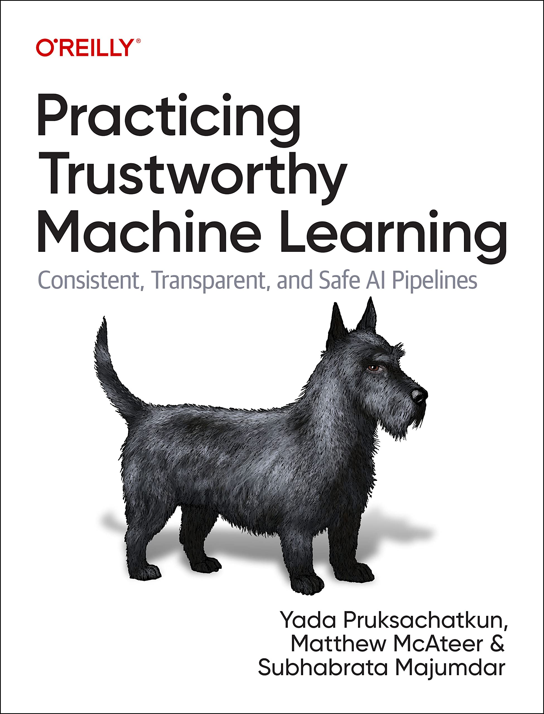

<div id="top"></div>

<!-- PROJECT SHIELDS
*** I'm using markdown "reference style" links for readability.
*** Reference links are enclosed in brackets [ ] instead of parentheses ( ).
*** See the bottom of this document for the declaration of the reference variables
*** for contributors-url, forks-url, etc. This is an optional, concise syntax you may use.
*** https://www.markdownguide.org/basic-syntax/#reference-style-links
-->

[![Contributors][contributors-shield]][contributors-url]
[![Forks][forks-shield]][forks-url]
[![Stargazers][stars-shield]][stars-url]
[![Issues][issues-shield]][issues-url]
[![Apache License][license-shield]][license-url]
[![LinkedIn][linkedin-shield]][linkedin-url]
[![Maintainability Rating][maintainability-shield]][maintainability-url]
[![Technical Debt][technical-debt-shield]][technical-debt-url]
[![Lines of Code][lines-of-code-shield]][lines-of-code-url]
[![Code Smells][code-smells-shield]][code-smells-url]
[![Security Rating][security-rating-shield]][security-rating-url]
[![Bugs][bugs-shield]][bugs-url]
[![Vulnerabilities][vulnerabilities-shield]][vulnerabilities-url]
[![Duplicated Lines (%)][duplicated-lines-shield]][duplicated-lines-url]
[![Reliability Rating][reliability-rating-shield]][reliability-rating-url]

<!-- PROJECT LOGO -->

<br />
<div align="center">
  <a href="https://github.com/matthew-mcateer/practicing_trustworthy_machine_learning">
    
  </a>

<h3 align="center">Practicing Trustworthy Machine Learning</h3>

  <p align="center">
    A book on how to make ML products that users can trust
    <br />
    <a href="https://github.com/matthew-mcateer/practicing_trustworthy_machine_learning"><strong>Explore the docs »</strong></a>
    <br />
    <br />
    <a href="#usage">View Demo</a>
    ·
    <a href="https://github.com/matthew-mcateer/practicing_trustworthy_machine_learning/issues">Report Bug</a>
    ·
    <a href="https://github.com/matthew-mcateer/practicing_trustworthy_machine_learning/issues">Request Feature</a>
  </p>
</div>


<!-- TABLE OF CONTENTS -->

<details>
  <summary>Table of Contents</summary>
  <ol>
    <li>
      <a href="#about-the-project">About The Project</a>
      <ul>
        <li><a href="#built-with">Built With</a></li>
      </ul>
    </li>
    <li>
      <a href="#getting-started">Getting Started</a>
      <ul>
        <li><a href="#prerequisites">Prerequisites</a></li>
        <li><a href="#installation">Installation</a></li>
      </ul>
    </li>
    <li><a href="#usage">Usage</a></li>
    <li><a href="#roadmap">Roadmap</a></li>
    <li><a href="#contributing">Contributing</a></li>
    <li><a href="#license">License</a></li>
    <li><a href="#contact">Contact</a></li>
    <li><a href="#acknowledgments">Acknowledgments</a></li>
  </ol>
</details>


<!-- ABOUT THE PROJECT -->

[](https://app.fossa.com/projects/git%2Bgithub.com%2Fmatthew-mcateer%2Fpracticing_trustworthy_machine_learning?ref=badge_large)

## About The Project

[![Product Name Screen Shot][product-screenshot]](images/book_cover.jpg)

[](https://app.fossa.com/projects/git%2Bgithub.com%2Fmatthew-mcateer%2Fpracticing_trustworthy_machine_learning?ref=badge_shield)

A book on how to make ML products that users can trust. [Available on Amazon](https://www.amazon.com/Practicing-Trustworthy-Machine-Learning-Transparent/dp/1098120272/)

<p align="right">(<a href="#top">back to top</a>)</p>

### Built With

* [PyTorch](https://pytorch.org/)
* [Scikit-Learn](https://scikit-learn.org/stable/)
* [HuggingFace](https://huggingface.co/)
* [OpenMined](https://www.openmined.org/)

<p align="right">(<a href="#top">back to top</a>)</p>


<!-- GETTING STARTED -->
## Getting Started

For running the notebooks on the cloud, you can skip ahead to the [Usage](#usage) section.
Note that most chapters require a GPU to run in a reasonable amount of time, so we recommend one of the cloud platforms as they come pre-installed with CUDA.

To get a local copy up and running follow these simple steps:

### Prerequisites

Here is a list of prerequisites you need to install before you can start using the examples in this repo.

* python 3.6 or later

### Installation

1. To run the notebooks on your own machine, first clone the repository and navigate to it:
  ```bash
  $ git clone https://github.com/matthew-mcateer/practicing_trustworthy_machine_learning.git
  $ cd practicing_trustworthy_machine_learning
  ```
2. Next, run the following command to create a `conda` virtual environment that contains all the libraries needed to run the notebooks:
  ```bash
  $ conda env create -f environment.yml
  ```
  Alternatlively, you can use [`mamba`](https://mamba.readthedocs.io/en/latest/index.html), which is a faster way of building `conda` environments:
  ```bash
  $ mamba env create -f environment.yml
  ```
3. Once you've installed the dependencies, you can activate the `conda` environment and spin up the notebooks as follows:
  ```bash
  $ conda activate book
  $ jupyter notebook
  ```
  (if using [`mamba`](https://mamba.readthedocs.io/en/latest/index.html), you should still use conda for activation and deactivation.)

<p align="right">(<a href="#top">back to top</a>)</p>


<!-- USAGE EXAMPLES -->
## Usage

The usage of these code samples is detailed in the O'Reilly book ["Practicing Trustworthy Machine Learning"](https://www.oreilly.com/library/view/practicing-trustworthy-machine/9781098120269/).

_For more details on these examples, please refer to the [Book these samples come from](https://www.oreilly.com/library/view/practicing-trustworthy-machine/9781098120269/)_

A few places where you can get access to a GPU without paying for it:

1. Google Colab
2. Kaggle
3. Gradient
4. Studio Lab

To use these cloud resources, you can click on one of the following links:

<!--This table is automatically generated, do not fill manually!-->


| Chapter                                                                                                                                         | GitHub                                                                                                                                                                                                                                                                                 | Colab                                                                                                                                                                                                                                                                                   | Kaggle                                                                                                                                                                                                                                                                                       | Gradient                                                                                                                                                                                                                                                                   | Studio Lab                                                                                                                                                                                                                                                                                       | Binder                                                                                                                                                                                                                                                                                                                                                  |
|:------------------------------------------------------------------------------------------------------------------------------------------------|:---------------------------------------------------------------------------------------------------------------------------------------------------------------------------------------------------------------------------------------------------------------------------------------|:----------------------------------------------------------------------------------------------------------------------------------------------------------------------------------------------------------------------------------------------------------------------------------------|:---------------------------------------------------------------------------------------------------------------------------------------------------------------------------------------------------------------------------------------------------------------------------------------------|:---------------------------------------------------------------------------------------------------------------------------------------------------------------------------------------------------------------------------------------------------------------------------|:-------------------------------------------------------------------------------------------------------------------------------------------------------------------------------------------------------------------------------------------------------------------------------------------------|:--------------------------------------------------------------------------------------------------------------------------------------------------------------------------------------------------------------------------------------------------------------------------------------------------------------------------------------------------------|
| [Chapter 1: BERT attack](1_privacy/Chapter_1_BERT_attack.ipynb)                                                                                 | [](https://github.com/matthew-mcateer/practicing_trustworthy_machine_learning/blob/main/1_privacy/Chapter_1_BERT_attack.ipynb)                                                          | [](https://colab.research.google.com/github/matthew-mcateer/practicing_trustworthy_machine_learning/blob/main/1_privacy/Chapter_1_BERT_attack.ipynb)                                                          | [](https://kaggle.com/kernels/welcome?src=https://github.com/matthew-mcateer/practicing_trustworthy_machine_learning/blob/main/1_privacy/Chapter_1_BERT_attack.ipynb)                                                          | [](https://console.paperspace.com/github/matthew-mcateer/practicing_trustworthy_machine_learning/blob/main/1_privacy/Chapter_1_BERT_attack.ipynb)                                                          | [](https://studiolab.sagemaker.aws/import/github/matthew-mcateer/practicing_trustworthy_machine_learning/blob/main/1_privacy/Chapter_1_BERT_attack.ipynb)                                                          | [](https://mybinder.org/v2/gh/matthew-mcateer/practicing_trustworthy_machine_learning/HEAD?urlpath=https%3A%2F%2Fgithub.com%2Fmatthew-mcateer%2Fpracticing_trustworthy_machine_learning%2Fblob%2Fmain%2F1_privacy%2FChapter_1_BERT_attack.ipynb)                                                          |
| [Chapter 1: Pytorch DP Demo](1_privacy/Chapter_1_Pytorch_DP_Demo.ipynb)                                                                         | [](https://github.com/matthew-mcateer/practicing_trustworthy_machine_learning/blob/main/1_privacy/Chapter_1_Pytorch_DP_Demo.ipynb)                                                      | [](https://colab.research.google.com/github/matthew-mcateer/practicing_trustworthy_machine_learning/blob/main/1_privacy/Chapter_1_Pytorch_DP_Demo.ipynb)                                                      | [](https://kaggle.com/kernels/welcome?src=https://github.com/matthew-mcateer/practicing_trustworthy_machine_learning/blob/main/1_privacy/Chapter_1_Pytorch_DP_Demo.ipynb)                                                      | [](https://console.paperspace.com/github/matthew-mcateer/practicing_trustworthy_machine_learning/blob/main/1_privacy/Chapter_1_Pytorch_DP_Demo.ipynb)                                                      | [](https://studiolab.sagemaker.aws/import/github/matthew-mcateer/practicing_trustworthy_machine_learning/blob/main/1_privacy/Chapter_1_Pytorch_DP_Demo.ipynb)                                                      | [](https://mybinder.org/v2/gh/matthew-mcateer/practicing_trustworthy_machine_learning/HEAD?urlpath=https%3A%2F%2Fgithub.com%2Fmatthew-mcateer%2Fpracticing_trustworthy_machine_learning%2Fblob%2Fmain%2F1_privacy%2FChapter_1_Pytorch_DP_Demo.ipynb)                                                      |
| [Chapter 1: SMPC Example](1_privacy/Chapter_1_SMPC_Example.ipynb)                                                                               | [](https://github.com/matthew-mcateer/practicing_trustworthy_machine_learning/blob/main/1_privacy/Chapter_1_SMPC_Example.ipynb)                                                         | [](https://colab.research.google.com/github/matthew-mcateer/practicing_trustworthy_machine_learning/blob/main/1_privacy/Chapter_1_SMPC_Example.ipynb)                                                         | [](https://kaggle.com/kernels/welcome?src=https://github.com/matthew-mcateer/practicing_trustworthy_machine_learning/blob/main/1_privacy/Chapter_1_SMPC_Example.ipynb)                                                         | [](https://console.paperspace.com/github/matthew-mcateer/practicing_trustworthy_machine_learning/blob/main/1_privacy/Chapter_1_SMPC_Example.ipynb)                                                         | [](https://studiolab.sagemaker.aws/import/github/matthew-mcateer/practicing_trustworthy_machine_learning/blob/main/1_privacy/Chapter_1_SMPC_Example.ipynb)                                                         | [](https://mybinder.org/v2/gh/matthew-mcateer/practicing_trustworthy_machine_learning/HEAD?urlpath=https%3A%2F%2Fgithub.com%2Fmatthew-mcateer%2Fpracticing_trustworthy_machine_learning%2Fblob%2Fmain%2F1_privacy%2FChapter_1_SMPC_Example.ipynb)                                                         |
| [Chapter 2: Evaluating Causal LMs on BOLD](2_fairness_and_bias/Chapter_2_Evaluating_LMs_on_BOLD.ipynb)                                          | [](https://github.com/matthew-mcateer/practicing_trustworthy_machine_learning/blob/main/2_fairness_and_bias/Chapter_2_Evaluating_LMs_on_BOLD.ipynb)                                     | [](https://colab.research.google.com/github/matthew-mcateer/practicing_trustworthy_machine_learning/blob/main/2_fairness_and_bias/Chapter_2_Evaluating_LMs_on_BOLD.ipynb)                                     | [](https://kaggle.com/kernels/welcome?src=https://github.com/matthew-mcateer/practicing_trustworthy_machine_learning/blob/main/2_fairness_and_bias/Chapter_2_Evaluating_LMs_on_BOLD.ipynb)                                     | [](https://console.paperspace.com/github/matthew-mcateer/practicing_trustworthy_machine_learning/blob/main/2_fairness_and_bias/Chapter_2_Evaluating_LMs_on_BOLD.ipynb)                                     | [](https://studiolab.sagemaker.aws/import/github/matthew-mcateer/practicing_trustworthy_machine_learning/blob/main/2_fairness_and_bias/Chapter_2_Evaluating_LMs_on_BOLD.ipynb)                                     | [](https://mybinder.org/v2/gh/matthew-mcateer/practicing_trustworthy_machine_learning/HEAD?urlpath=https%3A%2F%2Fgithub.com%2Fmatthew-mcateer%2Fpracticing_trustworthy_machine_learning%2Fblob%2Fmain%2F2_fairness_and_bias%2FChapter_2_Evaluating_LMs_on_BOLD.ipynb)                                     |
| [Chapter 3: CLIP Saliency mapping Part1](3_model_explainability_and_interpretability/Chapter_3_CLIP_Saliency_mapping_Part1.ipynb)               | [](https://github.com/matthew-mcateer/practicing_trustworthy_machine_learning/blob/main/3_model_explainability_and_interpretability/Chapter_3_CLIP_Saliency_mapping_Part1.ipynb)        | [](https://colab.research.google.com/github/matthew-mcateer/practicing_trustworthy_machine_learning/blob/main/3_model_explainability_and_interpretability/Chapter_3_CLIP_Saliency_mapping_Part1.ipynb)        | [](https://kaggle.com/kernels/welcome?src=https://github.com/matthew-mcateer/practicing_trustworthy_machine_learning/blob/main/3_model_explainability_and_interpretability/Chapter_3_CLIP_Saliency_mapping_Part1.ipynb)        | [](https://console.paperspace.com/github/matthew-mcateer/practicing_trustworthy_machine_learning/blob/main/3_model_explainability_and_interpretability/Chapter_3_CLIP_Saliency_mapping_Part1.ipynb)        | [](https://studiolab.sagemaker.aws/import/github/matthew-mcateer/practicing_trustworthy_machine_learning/blob/main/3_model_explainability_and_interpretability/Chapter_3_CLIP_Saliency_mapping_Part1.ipynb)        | [](https://mybinder.org/v2/gh/matthew-mcateer/practicing_trustworthy_machine_learning/HEAD?urlpath=https%3A%2F%2Fgithub.com%2Fmatthew-mcateer%2Fpracticing_trustworthy_machine_learning%2Fblob%2Fmain%2F3_model_explainability_and_interpretability%2FChapter_3_CLIP_Saliency_mapping_Part1.ipynb)        |
| [Chapter 3: CLIP Saliency mapping Part2](3_model_explainability_and_interpretability/Chapter_3_CLIP_Saliency_mapping_Part2.ipynb)               | [](https://github.com/matthew-mcateer/practicing_trustworthy_machine_learning/blob/main/3_model_explainability_and_interpretability/Chapter_3_CLIP_Saliency_mapping_Part2.ipynb)        | [](https://colab.research.google.com/github/matthew-mcateer/practicing_trustworthy_machine_learning/blob/main/3_model_explainability_and_interpretability/Chapter_3_CLIP_Saliency_mapping_Part2.ipynb)        | [](https://kaggle.com/kernels/welcome?src=https://github.com/matthew-mcateer/practicing_trustworthy_machine_learning/blob/main/3_model_explainability_and_interpretability/Chapter_3_CLIP_Saliency_mapping_Part2.ipynb)        | [](https://console.paperspace.com/github/matthew-mcateer/practicing_trustworthy_machine_learning/blob/main/3_model_explainability_and_interpretability/Chapter_3_CLIP_Saliency_mapping_Part2.ipynb)        | [](https://studiolab.sagemaker.aws/import/github/matthew-mcateer/practicing_trustworthy_machine_learning/blob/main/3_model_explainability_and_interpretability/Chapter_3_CLIP_Saliency_mapping_Part2.ipynb)        | [](https://mybinder.org/v2/gh/matthew-mcateer/practicing_trustworthy_machine_learning/HEAD?urlpath=https%3A%2F%2Fgithub.com%2Fmatthew-mcateer%2Fpracticing_trustworthy_machine_learning%2Fblob%2Fmain%2F3_model_explainability_and_interpretability%2FChapter_3_CLIP_Saliency_mapping_Part2.ipynb)        |
| [Chapter 3: Interpreting GPT](3_model_explainability_and_interpretability/Chapter_3_Interpreting_GPT.ipynb)                                     | [](https://github.com/matthew-mcateer/practicing_trustworthy_machine_learning/blob/main/3_model_explainability_and_interpretability/Chapter_3_Interpreting_GPT.ipynb)                   | [](https://colab.research.google.com/github/matthew-mcateer/practicing_trustworthy_machine_learning/blob/main/3_model_explainability_and_interpretability/Chapter_3_Interpreting_GPT.ipynb)                   | [](https://kaggle.com/kernels/welcome?src=https://github.com/matthew-mcateer/practicing_trustworthy_machine_learning/blob/main/3_model_explainability_and_interpretability/Chapter_3_Interpreting_GPT.ipynb)                   | [](https://console.paperspace.com/github/matthew-mcateer/practicing_trustworthy_machine_learning/blob/main/3_model_explainability_and_interpretability/Chapter_3_Interpreting_GPT.ipynb)                   | [](https://studiolab.sagemaker.aws/import/github/matthew-mcateer/practicing_trustworthy_machine_learning/blob/main/3_model_explainability_and_interpretability/Chapter_3_Interpreting_GPT.ipynb)                   | [](https://mybinder.org/v2/gh/matthew-mcateer/practicing_trustworthy_machine_learning/HEAD?urlpath=https%3A%2F%2Fgithub.com%2Fmatthew-mcateer%2Fpracticing_trustworthy_machine_learning%2Fblob%2Fmain%2F3_model_explainability_and_interpretability%2FChapter_3_Interpreting_GPT.ipynb)                   |
| [Chapter 3: Intrinsically Interpretable Models](3_model_explainability_and_interpretability/Chapter_3_Intrinsically_Interpretable_Models.ipynb) | [](https://github.com/matthew-mcateer/practicing_trustworthy_machine_learning/blob/main/3_model_explainability_and_interpretability/Chapter_3_Intrinsically_Interpretable_Models.ipynb) | [](https://colab.research.google.com/github/matthew-mcateer/practicing_trustworthy_machine_learning/blob/main/3_model_explainability_and_interpretability/Chapter_3_Intrinsically_Interpretable_Models.ipynb) | [](https://kaggle.com/kernels/welcome?src=https://github.com/matthew-mcateer/practicing_trustworthy_machine_learning/blob/main/3_model_explainability_and_interpretability/Chapter_3_Intrinsically_Interpretable_Models.ipynb) | [](https://console.paperspace.com/github/matthew-mcateer/practicing_trustworthy_machine_learning/blob/main/3_model_explainability_and_interpretability/Chapter_3_Intrinsically_Interpretable_Models.ipynb) | [](https://studiolab.sagemaker.aws/import/github/matthew-mcateer/practicing_trustworthy_machine_learning/blob/main/3_model_explainability_and_interpretability/Chapter_3_Intrinsically_Interpretable_Models.ipynb) | [](https://mybinder.org/v2/gh/matthew-mcateer/practicing_trustworthy_machine_learning/HEAD?urlpath=https%3A%2F%2Fgithub.com%2Fmatthew-mcateer%2Fpracticing_trustworthy_machine_learning%2Fblob%2Fmain%2F3_model_explainability_and_interpretability%2FChapter_3_Intrinsically_Interpretable_Models.ipynb) |
| [Chapter 3: LIME for Transformers](3_model_explainability_and_interpretability/Chapter_3_LIME_for_Transformers.ipynb)                           | [](https://github.com/matthew-mcateer/practicing_trustworthy_machine_learning/blob/main/3_model_explainability_and_interpretability/Chapter_3_LIME_for_Transformers.ipynb)              | [](https://colab.research.google.com/github/matthew-mcateer/practicing_trustworthy_machine_learning/blob/main/3_model_explainability_and_interpretability/Chapter_3_LIME_for_Transformers.ipynb)              | [](https://kaggle.com/kernels/welcome?src=https://github.com/matthew-mcateer/practicing_trustworthy_machine_learning/blob/main/3_model_explainability_and_interpretability/Chapter_3_LIME_for_Transformers.ipynb)              | [](https://console.paperspace.com/github/matthew-mcateer/practicing_trustworthy_machine_learning/blob/main/3_model_explainability_and_interpretability/Chapter_3_LIME_for_Transformers.ipynb)              | [](https://studiolab.sagemaker.aws/import/github/matthew-mcateer/practicing_trustworthy_machine_learning/blob/main/3_model_explainability_and_interpretability/Chapter_3_LIME_for_Transformers.ipynb)              | [](https://mybinder.org/v2/gh/matthew-mcateer/practicing_trustworthy_machine_learning/HEAD?urlpath=https%3A%2F%2Fgithub.com%2Fmatthew-mcateer%2Fpracticing_trustworthy_machine_learning%2Fblob%2Fmain%2F3_model_explainability_and_interpretability%2FChapter_3_LIME_for_Transformers.ipynb)              |
| [Chapter 3: SHAP for Transformers](3_model_explainability_and_interpretability/Chapter_3_SHAP_for_Transformers.ipynb)                           | [](https://github.com/matthew-mcateer/practicing_trustworthy_machine_learning/blob/main/3_model_explainability_and_interpretability/Chapter_3_SHAP_for_Transformers.ipynb)              | [](https://colab.research.google.com/github/matthew-mcateer/practicing_trustworthy_machine_learning/blob/main/3_model_explainability_and_interpretability/Chapter_3_SHAP_for_Transformers.ipynb)              | [](https://kaggle.com/kernels/welcome?src=https://github.com/matthew-mcateer/practicing_trustworthy_machine_learning/blob/main/3_model_explainability_and_interpretability/Chapter_3_SHAP_for_Transformers.ipynb)              | [](https://console.paperspace.com/github/matthew-mcateer/practicing_trustworthy_machine_learning/blob/main/3_model_explainability_and_interpretability/Chapter_3_SHAP_for_Transformers.ipynb)              | [](https://studiolab.sagemaker.aws/import/github/matthew-mcateer/practicing_trustworthy_machine_learning/blob/main/3_model_explainability_and_interpretability/Chapter_3_SHAP_for_Transformers.ipynb)              | [](https://mybinder.org/v2/gh/matthew-mcateer/practicing_trustworthy_machine_learning/HEAD?urlpath=https%3A%2F%2Fgithub.com%2Fmatthew-mcateer%2Fpracticing_trustworthy_machine_learning%2Fblob%2Fmain%2F3_model_explainability_and_interpretability%2FChapter_3_SHAP_for_Transformers.ipynb)              |
| [Chapter 4: HopSkipJump Attack on ImageNet](4_robustness/Chapter_4_HopSkipJump_Attack_on_ImageNet.ipynb)                                        | [](https://github.com/matthew-mcateer/practicing_trustworthy_machine_learning/blob/main/4_robustness/Chapter_4_HopSkipJump_Attack_on_ImageNet.ipynb)                                    | [](https://colab.research.google.com/github/matthew-mcateer/practicing_trustworthy_machine_learning/blob/main/4_robustness/Chapter_4_HopSkipJump_Attack_on_ImageNet.ipynb)                                    | [](https://kaggle.com/kernels/welcome?src=https://github.com/matthew-mcateer/practicing_trustworthy_machine_learning/blob/main/4_robustness/Chapter_4_HopSkipJump_Attack_on_ImageNet.ipynb)                                    | [](https://console.paperspace.com/github/matthew-mcateer/practicing_trustworthy_machine_learning/blob/main/4_robustness/Chapter_4_HopSkipJump_Attack_on_ImageNet.ipynb)                                    | [](https://studiolab.sagemaker.aws/import/github/matthew-mcateer/practicing_trustworthy_machine_learning/blob/main/4_robustness/Chapter_4_HopSkipJump_Attack_on_ImageNet.ipynb)                                    | [](https://mybinder.org/v2/gh/matthew-mcateer/practicing_trustworthy_machine_learning/HEAD?urlpath=https%3A%2F%2Fgithub.com%2Fmatthew-mcateer%2Fpracticing_trustworthy_machine_learning%2Fblob%2Fmain%2F4_robustness%2FChapter_4_HopSkipJump_Attack_on_ImageNet.ipynb)                                    |
| [Chapter 4: Simple Transparent Adversarial Examples](4_robustness/Chapter_4_Simple_Transparent_Adversarial_Examples.ipynb)                      | [](https://github.com/matthew-mcateer/practicing_trustworthy_machine_learning/blob/main/4_robustness/Chapter_4_Simple_Transparent_Adversarial_Examples.ipynb)                           | [](https://colab.research.google.com/github/matthew-mcateer/practicing_trustworthy_machine_learning/blob/main/4_robustness/Chapter_4_Simple_Transparent_Adversarial_Examples.ipynb)                           | [](https://kaggle.com/kernels/welcome?src=https://github.com/matthew-mcateer/practicing_trustworthy_machine_learning/blob/main/4_robustness/Chapter_4_Simple_Transparent_Adversarial_Examples.ipynb)                           | [](https://console.paperspace.com/github/matthew-mcateer/practicing_trustworthy_machine_learning/blob/main/4_robustness/Chapter_4_Simple_Transparent_Adversarial_Examples.ipynb)                           | [](https://studiolab.sagemaker.aws/import/github/matthew-mcateer/practicing_trustworthy_machine_learning/blob/main/4_robustness/Chapter_4_Simple_Transparent_Adversarial_Examples.ipynb)                           | [](https://mybinder.org/v2/gh/matthew-mcateer/practicing_trustworthy_machine_learning/HEAD?urlpath=https%3A%2F%2Fgithub.com%2Fmatthew-mcateer%2Fpracticing_trustworthy_machine_learning%2Fblob%2Fmain%2F4_robustness%2FChapter_4_Simple_Transparent_Adversarial_Examples.ipynb)                           |
| [Chapter 5: Synthetic Data Blender](5_secure_and_trustworthy_data_generation/Chapter_5_Synthetic_Data_Blender.ipynb)                            | [](https://github.com/matthew-mcateer/practicing_trustworthy_machine_learning/blob/main/5_secure_and_trustworthy_data_generation/Chapter_5_Synthetic_Data_Blender.ipynb)                | [](https://colab.research.google.com/github/matthew-mcateer/practicing_trustworthy_machine_learning/blob/main/5_secure_and_trustworthy_data_generation/Chapter_5_Synthetic_Data_Blender.ipynb)                | [](https://kaggle.com/kernels/welcome?src=https://github.com/matthew-mcateer/practicing_trustworthy_machine_learning/blob/main/5_secure_and_trustworthy_data_generation/Chapter_5_Synthetic_Data_Blender.ipynb)                | [](https://console.paperspace.com/github/matthew-mcateer/practicing_trustworthy_machine_learning/blob/main/5_secure_and_trustworthy_data_generation/Chapter_5_Synthetic_Data_Blender.ipynb)                | [](https://studiolab.sagemaker.aws/import/github/matthew-mcateer/practicing_trustworthy_machine_learning/blob/main/5_secure_and_trustworthy_data_generation/Chapter_5_Synthetic_Data_Blender.ipynb)                | [](https://mybinder.org/v2/gh/matthew-mcateer/practicing_trustworthy_machine_learning/HEAD?urlpath=https%3A%2F%2Fgithub.com%2Fmatthew-mcateer%2Fpracticing_trustworthy_machine_learning%2Fblob%2Fmain%2F5_secure_and_trustworthy_data_generation%2FChapter_5_Synthetic_Data_Blender.ipynb)                |
| [Chapter 5: Synthetic Data Fractals](5_secure_and_trustworthy_data_generation/Chapter_5_Synthetic_Data_Fractals.ipynb)                          | [](https://github.com/matthew-mcateer/practicing_trustworthy_machine_learning/blob/main/5_secure_and_trustworthy_data_generation/Chapter_5_Synthetic_Data_Fractals.ipynb)               | [](https://colab.research.google.com/github/matthew-mcateer/practicing_trustworthy_machine_learning/blob/main/5_secure_and_trustworthy_data_generation/Chapter_5_Synthetic_Data_Fractals.ipynb)               | [](https://kaggle.com/kernels/welcome?src=https://github.com/matthew-mcateer/practicing_trustworthy_machine_learning/blob/main/5_secure_and_trustworthy_data_generation/Chapter_5_Synthetic_Data_Fractals.ipynb)               | [](https://console.paperspace.com/github/matthew-mcateer/practicing_trustworthy_machine_learning/blob/main/5_secure_and_trustworthy_data_generation/Chapter_5_Synthetic_Data_Fractals.ipynb)               | [](https://studiolab.sagemaker.aws/import/github/matthew-mcateer/practicing_trustworthy_machine_learning/blob/main/5_secure_and_trustworthy_data_generation/Chapter_5_Synthetic_Data_Fractals.ipynb)               | [](https://mybinder.org/v2/gh/matthew-mcateer/practicing_trustworthy_machine_learning/HEAD?urlpath=https%3A%2F%2Fgithub.com%2Fmatthew-mcateer%2Fpracticing_trustworthy_machine_learning%2Fblob%2Fmain%2F5_secure_and_trustworthy_data_generation%2FChapter_5_Synthetic_Data_Fractals.ipynb)               |
| [Chapter 6: Federated Learning Simulations](6_more_state_of_the_art_research_questions/Chapter_6_Federated_Learning_Simulations.ipynb)          | [](https://github.com/matthew-mcateer/practicing_trustworthy_machine_learning/blob/main/6_more_state_of_the_art_research_questions/Chapter_6_Federated_Learning_Simulations.ipynb)      | [](https://colab.research.google.com/github/matthew-mcateer/practicing_trustworthy_machine_learning/blob/main/6_more_state_of_the_art_research_questions/Chapter_6_Federated_Learning_Simulations.ipynb)      | [](https://kaggle.com/kernels/welcome?src=https://github.com/matthew-mcateer/practicing_trustworthy_machine_learning/blob/main/6_more_state_of_the_art_research_questions/Chapter_6_Federated_Learning_Simulations.ipynb)      | [](https://console.paperspace.com/github/matthew-mcateer/practicing_trustworthy_machine_learning/blob/main/6_more_state_of_the_art_research_questions/Chapter_6_Federated_Learning_Simulations.ipynb)      | [](https://studiolab.sagemaker.aws/import/github/matthew-mcateer/practicing_trustworthy_machine_learning/blob/main/6_more_state_of_the_art_research_questions/Chapter_6_Federated_Learning_Simulations.ipynb)      | [](https://mybinder.org/v2/gh/matthew-mcateer/practicing_trustworthy_machine_learning/HEAD?urlpath=https%3A%2F%2Fgithub.com%2Fmatthew-mcateer%2Fpracticing_trustworthy_machine_learning%2Fblob%2Fmain%2F6_more_state_of_the_art_research_questions%2FChapter_6_Federated_Learning_Simulations.ipynb)      |
| [Chapter 6: Homomorphic Encryption NN](6_more_state_of_the_art_research_questions/Chapter_6_Homomorphic_Encryption_NN.ipynb)                    | [](https://github.com/matthew-mcateer/practicing_trustworthy_machine_learning/blob/main/6_more_state_of_the_art_research_questions/Chapter_6_Homomorphic_Encryption_NN.ipynb)           | [](https://colab.research.google.com/github/matthew-mcateer/practicing_trustworthy_machine_learning/blob/main/6_more_state_of_the_art_research_questions/Chapter_6_Homomorphic_Encryption_NN.ipynb)           | [](https://kaggle.com/kernels/welcome?src=https://github.com/matthew-mcateer/practicing_trustworthy_machine_learning/blob/main/6_more_state_of_the_art_research_questions/Chapter_6_Homomorphic_Encryption_NN.ipynb)           | [](https://console.paperspace.com/github/matthew-mcateer/practicing_trustworthy_machine_learning/blob/main/6_more_state_of_the_art_research_questions/Chapter_6_Homomorphic_Encryption_NN.ipynb)           | [](https://studiolab.sagemaker.aws/import/github/matthew-mcateer/practicing_trustworthy_machine_learning/blob/main/6_more_state_of_the_art_research_questions/Chapter_6_Homomorphic_Encryption_NN.ipynb)           | [](https://mybinder.org/v2/gh/matthew-mcateer/practicing_trustworthy_machine_learning/HEAD?urlpath=https%3A%2F%2Fgithub.com%2Fmatthew-mcateer%2Fpracticing_trustworthy_machine_learning%2Fblob%2Fmain%2F6_more_state_of_the_art_research_questions%2FChapter_6_Homomorphic_Encryption_NN.ipynb)           |
| [Chapter 7: Bootstrap Confidence Intervals](7_from_theory_to_practice/Chapter_7_Bootstrapping_Code_sample.ipynb)                                | [](https://github.com/matthew-mcateer/practicing_trustworthy_machine_learning/blob/main/7_from_theory_to_practice/Chapter_7_Bootstrapping_Code_sample.ipynb)                            | [](https://colab.research.google.com/github/matthew-mcateer/practicing_trustworthy_machine_learning/blob/main/7_from_theory_to_practice/Chapter_7_Bootstrapping_Code_sample.ipynb)                            | [](https://kaggle.com/kernels/welcome?src=https://github.com/matthew-mcateer/practicing_trustworthy_machine_learning/blob/main/7_from_theory_to_practice/Chapter_7_Bootstrapping_Code_sample.ipynb)                            | [](https://console.paperspace.com/github/matthew-mcateer/practicing_trustworthy_machine_learning/blob/main/7_from_theory_to_practice/Chapter_7_Bootstrapping_Code_sample.ipynb)                            | [](https://studiolab.sagemaker.aws/import/github/matthew-mcateer/practicing_trustworthy_machine_learning/blob/main/7_from_theory_to_practice/Chapter_7_Bootstrapping_Code_sample.ipynb)                            | [](https://mybinder.org/v2/gh/matthew-mcateer/practicing_trustworthy_machine_learning/HEAD?urlpath=https%3A%2F%2Fgithub.com%2Fmatthew-mcateer%2Fpracticing_trustworthy_machine_learning%2Fblob%2Fmain%2F7_from_theory_to_practice%2FChapter_7_Bootstrapping_Code_sample.ipynb)                            |
| [Chapter 7: Triangle Plot](7_from_theory_to_practice/Chapter_7_Triangle_Plot.ipynb)                                                             | [](https://github.com/matthew-mcateer/practicing_trustworthy_machine_learning/blob/main/7_from_theory_to_practice/Chapter_7_Triangle_Plot.ipynb)                                        | [](https://colab.research.google.com/github/matthew-mcateer/practicing_trustworthy_machine_learning/blob/main/7_from_theory_to_practice/Chapter_7_Triangle_Plot.ipynb)                                        | [](https://kaggle.com/kernels/welcome?src=https://github.com/matthew-mcateer/practicing_trustworthy_machine_learning/blob/main/7_from_theory_to_practice/Chapter_7_Triangle_Plot.ipynb)                                        | [](https://console.paperspace.com/github/matthew-mcateer/practicing_trustworthy_machine_learning/blob/main/7_from_theory_to_practice/Chapter_7_Triangle_Plot.ipynb)                                        | [](https://studiolab.sagemaker.aws/import/github/matthew-mcateer/practicing_trustworthy_machine_learning/blob/main/7_from_theory_to_practice/Chapter_7_Triangle_Plot.ipynb)                                        | [](https://mybinder.org/v2/gh/matthew-mcateer/practicing_trustworthy_machine_learning/HEAD?urlpath=https%3A%2F%2Fgithub.com%2Fmatthew-mcateer%2Fpracticing_trustworthy_machine_learning%2Fblob%2Fmain%2F7_from_theory_to_practice%2FChapter_7_Triangle_Plot.ipynb)                                        |

<!--End of table-->

Other resources include

5. Google Cloud 
6. Deepnote
7. Microsoft Azure
8. Amazon SageMaker

Some of these are free forever, some have quotas.
Usually most of these are better than buying expensive hardware.

<p align="right">(<a href="#top">back to top</a>)</p>


<!-- ROADMAP -->
## Roadmap

The first edition of this book is available for order on [O'Reilly](https://www.oreilly.com/library/view/practicing-trustworthy-machine/9781098120269/) as well as [Amazon](https://www.amazon.com/Practicing-Trustworthy-Machine-Learning-Transparent/dp/1098120272/)

See the [open issues](https://github.com/matthew-mcateer/practicing_trustworthy_machine_learning/issues) for a full list of proposed features (and known issues).

<p align="right">(<a href="#top">back to top</a>)</p>


<!-- CONTRIBUTING -->
## Contributing

Contributions are what make the open source community such an amazing place to learn, inspire, and create. Any contributions you make are **greatly appreciated**.

If you have a suggestion that would make this better, please fork the repo and create a pull request. You can also simply open an issue with the tag "enhancement".
Don't forget to give the project a star! Thanks again!

1. Fork the Project
2. Create your Feature Branch (`git checkout -b feature/AmazingFeature`)
3. Commit your Changes (`git commit -m 'Add some AmazingFeature'`)
4. Push to the Branch (`git push origin feature/AmazingFeature`)
5. Open a Pull Request

<p align="right">(<a href="#top">back to top</a>)</p>


<!-- LICENSE -->
## License

Distributed under the Apache License. See [`LICENSE`](LICENSE) for more information.

<p align="right">(<a href="#top">back to top</a>)</p>


<!-- CONTACT -->
## Contact

Matthew Mcateer (Author) - [@MatthewMcAteer0](https://twitter.com/MatthewMcAteer0) - oreillybook@5cubelabs.us

Yada Pruksachatkun (Author) - [@yadapruksachatk](https://twitter.com/yadapruksachatk) - yada@5cubelabs.us
 
Subhabrata Majumdar (Author) - [@sbmisi](https://twitter.com/sbmisi) - subho@5cubelabs.us

Project Link: [https://github.com/matthew-mcateer/practicing_trustworthy_machine_learning](https://github.com/matthew-mcateer/practicing_trustworthy_machine_learning)

<p align="right">(<a href="#top">back to top</a>)</p>


<!-- ACKNOWLEDGMENTS -->
## Acknowledgments

We'd like to thank the following people for their reviews and proofreading of the book, as well as for their work on many of the core technologies and libraries this book dives into:

* [Divesh Shrivastava]()
* [Kush Varshney]()
* [Jiahao Chen]()
* [Vinay Prabhu](https://twitter.com/vinayprabhu)
* [Josh Albrecht](https://twitter.com/joshalbrecht)
* [Kanjun Qiu](https://twitter.com/kanjun)
* [Chelsea Sierra Voss](https://twitter.com/csvoss)
* [Jwala Dhamala]()
* [Trista Cao]()
* [Andrew Trask](https://twitter.com/iamtrask)
* [Yonah Borns-Weil](https://scholar.google.co.uk/scholar?hl=en&as_sdt=0%2C5&q=author%3A%22Yonah+Borns-Weil%22&btnG=)
* [Alexander Ziller](https://scholar.google.co.uk/citations?user=Ir90mU4AAAAJ&hl=en&oi=ao)
* [Antonio Lopardo](https://scholar.google.co.uk/scholar?as_q=&num=10&btnG=Search+Scholar&as_epq=&as_oq=&as_eq=&as_occt=any&as_sauthors=%22Antonio%20Lopardo%22&as_publication=&as_ylo=&as_yhi=&as_allsubj=all&hl=en)
* [Benjamin Szymkow](https://scholar.google.co.uk/scholar?as_q=&num=10&btnG=Search+Scholar&as_epq=&as_oq=&as_eq=&as_occt=any&as_sauthors=%22Benjamin%20Szymkow%22&as_publication=&as_ylo=&as_yhi=&as_allsubj=all&hl=en)
* [Bobby Wagner](https://scholar.google.co.uk/citations?user=gQ4MPnkAAAAJ&hl=en&oi=ao)
* [Emma Bluemke](https://scholar.google.co.uk/citations?user=7ig0Hj0AAAAJ&hl=en&oi=ao)
* [Jean-Mickael Nounahon](https://scholar.google.co.uk/scholar?as_q=&num=10&btnG=Search+Scholar&as_epq=&as_oq=&as_eq=&as_occt=any&as_sauthors=%22Jean-Mickael%20Nounahon%22&as_publication=&as_ylo=&as_yhi=&as_allsubj=all&hl=en)
* [Jonathan Passerat-Palmbach](https://scholar.google.co.uk/scholar?as_q=&num=10&btnG=Search+Scholar&as_epq=&as_oq=&as_eq=&as_occt=any&as_sauthors=%22Jonathan%20Passerat-Palmbach%22&as_publication=&as_ylo=&as_yhi=&as_allsubj=all&hl=en)
* [Kritika Prakash](https://scholar.google.co.uk/citations?user=JC0iWhMAAAAJ&hl=en&oi=ao)
* [Nick Rose]()
* [Théo Ryffel](https://scholar.google.co.uk/citations?user=JbSRqs8AAAAJ&hl=en&oi=ao)
* [Zarreen Naowal Reza](https://scholar.google.co.uk/citations?user=YTYweEwAAAAJ&hl=en&oi=ao)
* [Georgios Kaissis](https://twitter.com/GKaissis)

We would also like to dedicate this book to the memory of security researcher, internet privacy activist, and AI ethics researcher [Peter Eckersley](https://www.wsj.com/articles/peter-eckersleyhelped-encrypt-internet-traffic-to-foil-snoops-11662732014) (1979 to 2022). Thanks for your work on tools such as Let’s Encrypt, Privacy Badger, Certbot, HTTPS Everywhere, SSL Observatory and Panopticlick, for advancing AI ethics in a pragmatic, policy-focused, and actionable way. Thank you also for offering to proofread this book in what unexpectedly turned out to be your last months.

<p align="right">(<a href="#top">back to top</a>)</p>


<!-- MARKDOWN LINKS & IMAGES -->
<!-- https://www.markdownguide.org/basic-syntax/#reference-style-links -->

[contributors-shield]: https://img.shields.io/github/contributors/matthew-mcateer/practicing_trustworthy_machine_learning.svg?style=for-the-badge
[contributors-url]: https://github.com/matthew-mcateer/practicing_trustworthy_machine_learning/graphs/contributors
[forks-shield]: https://img.shields.io/github/forks/matthew-mcateer/practicing_trustworthy_machine_learning.svg?style=for-the-badge
[forks-url]: https://github.com/matthew-mcateer/practicing_trustworthy_machine_learning/network/members
[stars-shield]: https://img.shields.io/github/stars/matthew-mcateer/practicing_trustworthy_machine_learning.svg?style=for-the-badge
[stars-url]: https://github.com/matthew-mcateer/practicing_trustworthy_machine_learning/stargazers
[issues-shield]: https://img.shields.io/github/issues/matthew-mcateer/practicing_trustworthy_machine_learning.svg?style=for-the-badge
[issues-url]: https://github.com/matthew-mcateer/practicing_trustworthy_machine_learning/issues
[license-shield]: https://img.shields.io/github/license/matthew-mcateer/practicing_trustworthy_machine_learning.svg?style=for-the-badge
[license-url]: https://github.com/matthew-mcateer/practicing_trustworthy_machine_learning/blob/master/LICENSE
[linkedin-shield]: https://img.shields.io/badge/-LinkedIn-black.svg?style=for-the-badge&logo=linkedin&colorB=555
[linkedin-url]: https://linkedin.com/in/matthewmcateer0
[product-screenshot]: images/book_cover.jpg
[maintainability-shield]: https://sonarcloud.io/api/project_badges/measure?project=matthew-mcateer_practicing_trustworthy_machine_learning&metric=sqale_rating
[maintainability-url]: https://sonarcloud.io/summary/new_code?id=matthew-mcateer_practicing_trustworthy_machine_learning
[technical-debt-shield]: https://sonarcloud.io/api/project_badges/measure?project=matthew-mcateer_practicing_trustworthy_machine_learning&metric=sqale_index
[technical-debt-url]: https://sonarcloud.io/summary/new_code?id=matthew-mcateer_practicing_trustworthy_machine_learning
[lines-of-code-shield]: https://sonarcloud.io/api/project_badges/measure?project=matthew-mcateer_practicing_trustworthy_machine_learning&metric=ncloc
[lines-of-code-url]: https://sonarcloud.io/summary/new_code?id=matthew-mcateer_practicing_trustworthy_machine_learning
[code-smells-shield]: https://sonarcloud.io/api/project_badges/measure?project=matthew-mcateer_practicing_trustworthy_machine_learning&metric=code_smells
[code-smells-url]: https://sonarcloud.io/summary/new_code?id=matthew-mcateer_practicing_trustworthy_machine_learning
[security-rating-shield]: https://sonarcloud.io/api/project_badges/measure?project=matthew-mcateer_practicing_trustworthy_machine_learning&metric=security_rating
[security-rating-url]: https://sonarcloud.io/summary/new_code?id=matthew-mcateer_practicing_trustworthy_machine_learning
[bugs-shield]: https://sonarcloud.io/api/project_badges/measure?project=matthew-mcateer_practicing_trustworthy_machine_learning&metric=bugs
[bugs-url]: https://sonarcloud.io/summary/new_code?id=matthew-mcateer_practicing_trustworthy_machine_learning
[vulnerabilities-shield]: https://sonarcloud.io/api/project_badges/measure?project=matthew-mcateer_practicing_trustworthy_machine_learning&metric=vulnerabilities
[vulnerabilities-url]: https://sonarcloud.io/summary/new_code?id=matthew-mcateer_practicing_trustworthy_machine_learning
[duplicated-lines-shield]: https://sonarcloud.io/api/project_badges/measure?project=matthew-mcateer_practicing_trustworthy_machine_learning&metric=duplicated_lines_density
[duplicated-lines-url]: https://sonarcloud.io/summary/new_code?id=matthew-mcateer_practicing_trustworthy_machine_learning
[reliability-rating-shield]: https://sonarcloud.io/api/project_badges/measure?project=matthew-mcateer_practicing_trustworthy_machine_learning&metric=reliability_rating
[reliability-rating-url]: https://sonarcloud.io/summary/new_code?id=matthew-mcateer_practicing_trustworthy_machine_learning
